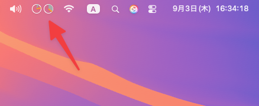
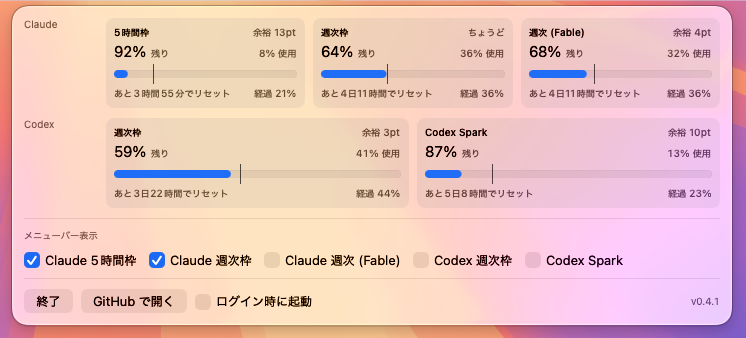

# MornAIMeter

Claude Code / Codex CLI の利用枠 (usage) をメニューバーの円グラフで見る、Mac ローカル完結の
常駐アプリ。




## Homebrew での導入

```bash
brew install --cask matsufriends/tap/mornaimeter
```

更新は `brew upgrade --cask mornaimeter`。

## 前提

- Claude Code (`claude login`) と Codex CLI (`codex login`) にログイン済みであること。
- このアプリは各 CLI がログイン時に保存したトークンを読み、Anthropic / OpenAI の公式
  usage API に残り枠を問い合わせています。
- 初回起動時に macOS がアクセス許可ダイアログを 1 回表示します。「常に許可」を選ぶと
  以後は表示されません。

## 開発

```bash
bash build-app.sh          # build/MornAIMeter.app を生成
swift build -c release
swift test
```

Xcode プロジェクト (.xcodeproj) は作らず、`swift build` のみで完結する。
